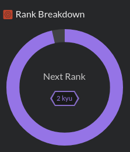

### Hi everybody 👋

I'm a Ruby on rails software engineer.

- 🔭 And this is me on codewars: [Lyams](https://www.codewars.com/users/Lyams) 

<!--
- [My new blog](https://lyams.github.io/Over-a-cup-of-hot-drink-with-Ilia/posts/) (on Russian; in development)
**Lyams/Lyams** is a ✨ _special_ ✨ repository because its `README.md` (this file) appears on your GitHub profile.
- 🌱 I’m currently learning ["Building your own authentication library with Trailblazer"](https://leanpub.com/buildalib) because I was offered to use Trailblazer in a test task for a Ruby Developer.

Here are some ideas to get you started:

- 🔭 I’m currently working on ...
- 🌱 I’m currently learning ...
- 👯 I’m looking to collaborate on ...
- 🤔 I’m looking for help with ...
- 💬 Ask me about ...
- 📫 How to reach me: ...
- 😄 Pronouns: ...
- ⚡ Fun fact: ...
-->
